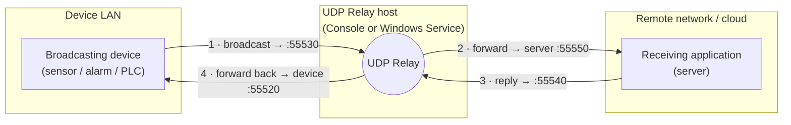

<div align="center">

# UDP Relay

**Bridge UDP broadcasts across network boundaries.**
Catch UDP broadcast (or unicast) messages on one LAN and relay them — in both directions — to an application on a different network.

[](https://github.com/jackwjensen/UDP_Relay/actions/workflows/build.yml)
[](LICENSE)
[](#requirements)
[](#requirements)
[](https://allegroit.dk/)

<sub>Built and maintained by <a href="https://allegroit.dk/"><b>Allegro IT ApS</b></a> — international project leadership, legacy-code maintenance & cloud hosting.</sub>

</div>

---

## What it does

UDP broadcasts don't cross routers. If a device shouts a UDP packet onto its local network, only listeners on that same network hear it — an application on another LAN, a VPN, or the cloud never sees it.

**UDP Relay** sits on a machine *inside* the device's network, listens for those packets, and forwards them to a remote endpoint you choose. It also relays the remote endpoint's answers back to the device, so request/response protocols keep working across the boundary.

### Typical use cases

- **Sensors, alarms, and IoT devices** that announce themselves or stream readings via UDP broadcast, while the monitoring application lives elsewhere (another site, a data centre, the cloud).
- **Legacy industrial / building-automation equipment** that only speaks LAN-local UDP and can't be reconfigured.
- **Bridging a discovery or telemetry protocol** from an isolated network segment to a central server.

> Have a device that's stuck on the wrong side of the network? Allegro IT does exactly this kind of integration and legacy-system work — [get in touch](#about-allegro-it).

---

## How it works

The relay runs two independent forwarding tasks so traffic flows **both ways**:



1. The device broadcasts a UDP packet; the relay is **listening on the client port**.
2. The relay **forwards** the packet to the configured remote server.
3. The server replies; the relay is **listening on the server port**.
4. The relay **forwards the reply back** to the device.

Each direction is just a `localEndPoint → relayEndPoint` pair, configured in XML — no recompiling to change addresses or ports.

---

## Solution structure

| Project | Target framework | Role |
| --- | --- | --- |
| **`UDP_Relay_Core`** | .NET Standard 2.0 | The reusable engine — relay logic, XML settings reader, pluggable logging, async cancellation. Usable from .NET Framework **and** modern .NET. |
| **`UDP_Relay_Console`** | .NET 8 / 9 / 10 | Cross-platform console host (Windows / Linux / macOS). |
| **`UDP_Relay_Service`** | .NET Framework 4.7.2 | Windows Service host with Windows Event Log integration and install scripts. |
| **`TestSender`** | .NET 8 / 9 / 10 | Test harness that simulates a broadcasting device. |
| **`TestReceiver`** | .NET 8 / 9 / 10 | Test harness that simulates the remote server (echoes replies). |
| **`UDP_Relay_Core.Tests`** | .NET 8 / 9 / 10 | xUnit test suite for the core engine (run with `dotnet test`). |

Run **either** the Console **or** the Service — both host the same core engine. Pick the Console for cross-platform or quick runs; pick the Service for an always-on Windows deployment.

### Notable engineering details

- **Bidirectional relaying** built from composable one-way tasks.
- **IPv4 and IPv6** support (address family is detected per endpoint).
- **Cancellable async I/O** — `UdpClient.ReceiveAsync()` has no built-in cancellation, so the core adds a `WithCancellation` extension for clean, prompt shutdown.
- **Pluggable logging** through `Microsoft.Extensions.Logging` — attach any `ILogger` (console, rolling file, Windows Event Log, …).
- **`IDisposable`** throughout for deterministic socket cleanup.

---

## Getting started

> **Prefer a prebuilt binary?** Self-contained builds (no .NET install required) for
> Windows and Linux are attached to each [release](https://github.com/jackwjensen/UDP_Relay/releases)
> — download, edit the `Settings_*.xml`, and run. To build from source instead, read on.

### Prerequisites

- [.NET 10 SDK](https://dotnet.microsoft.com/download) (for the Console, test harnesses and tests; the projects also target .NET 8 and 9).
- For the Windows Service: Windows with [.NET Framework 4.7.2](https://dotnet.microsoft.com/download/dotnet-framework) (the runtime ships with Windows 10/11).

### Build

```bash
git clone https://github.com/jackwjensen/UDP_Relay.git
cd UDP_Relay
dotnet build UDP_Relay.sln -c Release
```

> The Windows Service project targets classic .NET Framework and builds best in **Visual Studio** (or with MSBuild) on Windows. The Console and test apps are cross-platform and build/run anywhere with the .NET SDK (8, 9 or 10).

### Run the Console

The Console multi-targets .NET 8/9/10, so pass `-f` to pick a runtime:

```bash
cd UDP_Relay_Console
dotnet run -c Release -f net10.0
```

Edit `Settings_UDP_Relay_Console.xml` first (see [Configuration](#configuration)). Press any key to stop relaying.

### Run as a Windows Service

The Service project includes batch scripts (run from an **elevated** command prompt in the build output folder):

| Script | Action |
| --- | --- |
| `ServiceInstall.bat` | Register the service (`installutil`) |
| `ServiceStart.bat` | Start it (`sc start`) |
| `ServiceStop.bat` | Stop it (`sc stop`) |
| `ServiceUninstall.bat` | Remove it (`installutil /uninstall`) |

Settings live in `Settings_UDP_Relay_Service.xml` next to the executable. The service also writes to the Windows **Application** event log under source `UDP_Relay_Service`.

---

## Configuration

All endpoints are plain XML — change addresses and ports without rebuilding. The Console and Service share the same four-endpoint shape:

```xml
<UDP_Relay_Console>
  <ListeningClientPort>55530</ListeningClientPort>
  <ListeningClientIP>0.0.0.0</ListeningClientIP>     <!-- listen for the device -->
  <ListeningServerPort>55540</ListeningServerPort>
  <ListeningServerIP>0.0.0.0</ListeningServerIP>     <!-- listen for the server's reply -->
  <SendingClientPort>55520</SendingClientPort>
  <SendingClientIP>192.168.1.255</SendingClientIP>   <!-- where the device expects the reply -->
  <SendingServerPort>55550</SendingServerPort>
  <SendingServerIP>192.168.1.255</SendingServerIP>   <!-- the remote server's address -->
  <TimeOut>0</TimeOut>
</UDP_Relay_Console>
```

| Setting | Meaning |
| --- | --- |
| `ListeningClientIP` / `ListeningClientPort` | Interface and port the relay **listens on for the device's** packets. `0.0.0.0` = all interfaces. |
| `SendingServerIP` / `SendingServerPort` | Address the relay **forwards device packets to** — i.e. your remote server. |
| `ListeningServerIP` / `ListeningServerPort` | Interface and port the relay **listens on for the server's reply**. |
| `SendingClientIP` / `SendingClientPort` | Address the relay **forwards the reply back to** — i.e. the device. |
| `TimeOut` | Socket timeout in milliseconds; `0` means block indefinitely. |

> **Tip:** the sample uses the broadcast address `192.168.1.255` so replies reach any listener on the subnet. For a real cross-network setup, set `SendingServerIP` to your remote server's routable address (and adjust the subnet broadcast to match your LAN).

---

## Testing your setup

Three console apps let you prove the path end-to-end before wiring in real hardware:

1. Configure and start **`TestReceiver`** — stands in for your remote server; it echoes back whatever it receives.
2. Configure and start **`UDP_Relay_Console`** — the relay itself.
3. Configure and start **`TestSender`** — stands in for the broadcasting device; it sends 100 numbered packets and prints the replies it gets back.

With the default port layout, a packet travels `TestSender → Relay → TestReceiver → Relay → TestSender`. If `TestSender` prints the echoes, your relay path works. Adapt the settings files to mirror your real devices and servers.

### Automated tests

The core engine is covered by an [xUnit](https://xunit.net/) suite in `UDP_Relay_Core.Tests` — settings parsing, async cancellation, and a loopback relay round-trip — run across every target framework with:

```bash
dotnet test
```

Every push and pull request is built and tested on Windows via [GitHub Actions](.github/workflows/build.yml).

---

## Logging

Logging is **injectable**. The static `Logger` fans out to every `ILogger` you register via `Logger.AddLogger(...)`, and can also mirror to the console (`Logger.WriteToConsole` — off by default so the library stays quiet when embedded; the console host and test harnesses enable it). Out of the box:

- **Console** (in the console host + test harnesses) and **Debug** output.
- **Rolling file** logs — `.log` files in a `Logs/` folder (e.g. `UDP_Relay_Console<date>.0.log`) via `NetEscapades.Extensions.Logging.RollingFile`.
- **Windows Event Log** in the Service host.

Swap in Serilog, NLog, Application Insights, or anything else that exposes an `ILogger` — no changes to the relay core.

---

## Reuse the engine in your own project

`UDP_Relay_Core` is a standalone .NET Standard 2.0 library, so you can embed the relay directly:

```csharp
using System.Net;
using UDP_Relay_Core;

using var relay = new UDP_Relay();

// Forward device broadcasts (heard on :55530) to a remote server
relay.StartRelaying(
    localEndPoint: new IPEndPoint(IPAddress.Any, 55530),
    relayEndPoint: new IPEndPoint(IPAddress.Parse("203.0.113.10"), 55550));

// Relay the server's replies (heard on :55540) back to the device
relay.StartRelaying(
    localEndPoint: new IPEndPoint(IPAddress.Any, 55540),
    relayEndPoint: new IPEndPoint(IPAddress.Parse("192.168.1.255"), 55520));

// ... later ...
relay.StopRelaying();
```

`Send(...)` and `Receive(...)` helpers are also available for one-off datagrams.

---

## Requirements

- **Console & test apps:** .NET 8, 9 or 10 (cross-platform; multi-targeted).
- **Windows Service:** Windows + .NET Framework 4.7.2.
- **Core library:** .NET Standard 2.0 — works with .NET Framework 4.6.1+ and .NET 8/9/10 (and .NET Core 2.0+).

---

## License

Released under the [MIT License](LICENSE). © 2023 Jack W. Jensen.

---

## About Allegro IT

<div align="center">

[](https://allegroit.dk/)

***"International projektledelse med holdånd"*** — *international project management with team spirit.*

</div>

**Allegro IT ApS** is a Danish software consultancy specialising in **project leadership**, **legacy-code maintenance**, and **cloud hosting**. UDP Relay grew out of real integration work — connecting devices and systems that were never designed to talk to each other.

If you need to bridge protocols, modernise legacy systems, or get a stubborn piece of equipment talking to the cloud, we'd love to help.

- 🌐 Website: **[allegroit.dk](https://allegroit.dk/)**
- ✉️ Contact: **[kontakt@allegroit.dk](mailto:kontakt@allegroit.dk)**
- 📍 Randers, Denmark

<div align="center">
<sub>If this project helped you, a ⭐ on the repo is appreciated — and tell us what you built with it.</sub>
</div>
